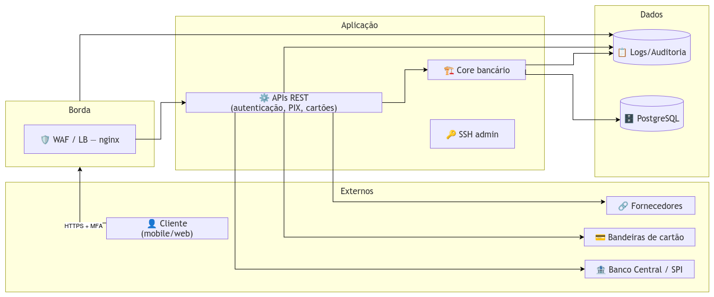

# Modelagem de Ameaças — Banco Digital Seguro (BDS)

## 1. DFD — Diagrama de Fluxo de Dados (nível de contexto)

- **Entidades externas:** Cliente (app mobile / internet banking), Banco Central/SPI (PIX), bandeiras de cartão e fornecedores parceiros.
- **Processos:** WAF/Load Balancer (nginx) na borda, APIs REST (autenticação, PIX, cartões), core bancário e acesso administrativo (SSH).
- **Armazenamentos:** PostgreSQL (contas, saldos, transações) e sistema de logs/auditoria.

- **Fluxos principais:** Cliente → nginx (HTTPS + MFA) → APIs → core bancário → PostgreSQL; APIs → SPI/PIX e bandeiras (liquidação/autorização); todos os componentes → logs.




## 2. STRIDE — ameaças por categoria

| Categoria STRIDE | O que ameaça no BDS | CVE relacionada |
|---|---|---|
| Spoofing (falsificação) | Atacante se passa por integração autorizada (parceiro SPI/PIX) ou pelo cliente | CVE-2025-23419 (bypass mTLS); CVE-2024-3094 (backdoor no sshd) |
| Tampering (adulteração) | Alteração de valores de transferência ou de dados no banco | CVE-2025-1094 (SQL injection); CVE-2021-44228 (RCE) |
| Repudiation (repúdio) | Logs comprometidos/apagados quebram o não-repúdio das operações | Logs sem CVE específica — impacto da perda de trilha |
| Information Disclosure (vazamento) | Exposição de saldos, dados pessoais e chaves PIX | CVE-2025-1094 (leitura via SQLi); CVE-2025-23419 (leitura limitada) |
| Denial of Service (indisponibilidade) | Indisponibilidade da plataforma e do PIX em períodos de volatilidade | Bordas e redundância (sem CVE específica mapeada) |
| Elevation of Privilege (elevação) | Escalada para RCE no servidor, no host ou no container | CVE-2021-44228; CVE-2024-6387; CVE-2024-21626; CVE-2024-3094 |

## 3. STRIDE — detalhamento por componente

| Elemento | Categoria | CVE | Ameaça | Impacto CIA | Mitigação (DevSecOps) |
|---|---|---|---|---|---|
| nginx (borda) | Spoofing | CVE-2025-23419 | Bypass do mTLS por retomada de sessão — atacante se passa por integração autorizada | C (baixo) | Atualizar nginx (1.27.4+/1.26.3+); revisar session tickets/cache nos vhosts default |
| APIs Java | Elevation + Tampering | CVE-2021-44228 | Log4Shell: RCE remoto sem autenticação via mensagem de log | C, I, A (altos) | Trivy no build; Log4j 2.17.1+; regras de WAF; monitoramento |
| PostgreSQL | Tampering + Disclosure | CVE-2025-1094 | SQL injection via funções de escape do libpq | C, I (altos) | Semgrep (SAST); consultas parametrizadas; patch 17.3+/16.7+; rede interna |
| SSH admin | Elevation | CVE-2024-6387 | regreSSHion: RCE remoto sem autenticação no sshd (glibc) | C, I, A (altos) | Patch OpenSSH 9.8p1; segmentação; chaves + MFA |
| Containers (runc) | Elevation | CVE-2024-21626 | Escape de container via vazamento de file descriptors | C, I, A (altos) | Atualizar runtime; seccomp/AppArmor; hardening de imagem |
| Dependências (xz) | Spoofing (supply chain) | CVE-2024-3094 | Backdoor no liblzma intercepta autenticação SSH | C, I, A (altos) | Verificação de integridade de dependências; SBOM; pin de versões |

<!-- ## 4. Priorização das ameaças

1. **Log4Shell (CVE-2021-44228)** — RCE remoto, exploit público, score final 9.6 → remediação imediata.
2. **regreSSHion (CVE-2024-6387)** — RCE remoto no acesso administrativo, score 8.1 → primeira janela de manutenção.
3. **PostgreSQL (CVE-2025-1094)** — ativo mais crítico do negócio, score final 7.0 → alta prioridade, mesmo com banco em rede interna.
4. **runc (CVE-2024-21626)** — escape exige acesso local, mas quebra o isolamento na AWS → média-alta.
5. **xz (CVE-2024-3094)** — versões afetadas já removidas pelas distribuições → preventiva (processo).
6. **nginx (CVE-2025-23419)** — score baixo, mas na borda e afeta mTLS das integrações → média.
```-->